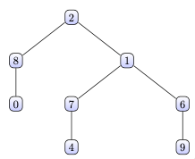

   Write a `toString` method for a binary tree of integers. The method should return `empty` for an empty tree. For a leaf node, it should return the data in the node as a `String`. For a branch node, it should return a parenthesised `String` that has three elements separated by commas:

    + the data at the root, followed by,
    + a `String` representation of the left subtree, followed by,
    + a `String` representation of the right subtree.

   For example, if a variable t stores a reference to the following tree:

   

   then the call `t.toString()` should return the following `String`:

   ```java
   (2, (8, 0, empty), (1, (7, 4, empty), (6, empty, 9)))
   ```

   You are writing `toString` as a public method for a binary tree class defined as follows:

   ```java
   package trees;
   public class IntTree {
       private IntTreeNode overallRoot;
       // <methods>
   }
   package trees;
   public class IntTreeNode {
       public int data; // data stored in this node
       public IntTreeNode left; // reference to left subtree
       public IntTreeNode right; // reference to right subtree
       //<constructors>
   }
   ```

   You may define private *helper methods* to solve this problem, but otherwise you may not call any other methods of the class. You may not define any auxiliary data structures to solve this problem.